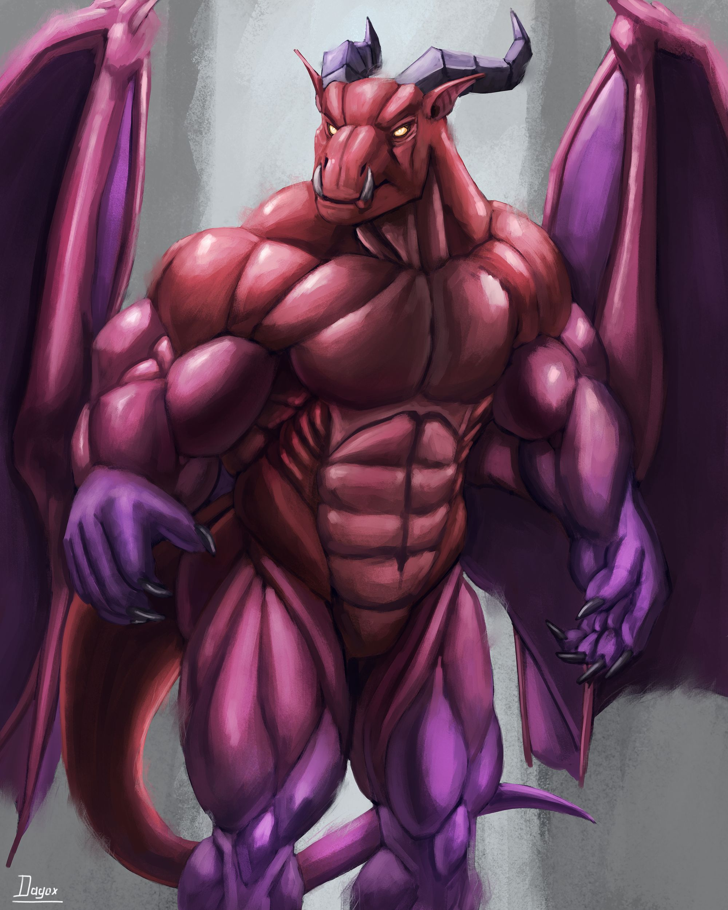
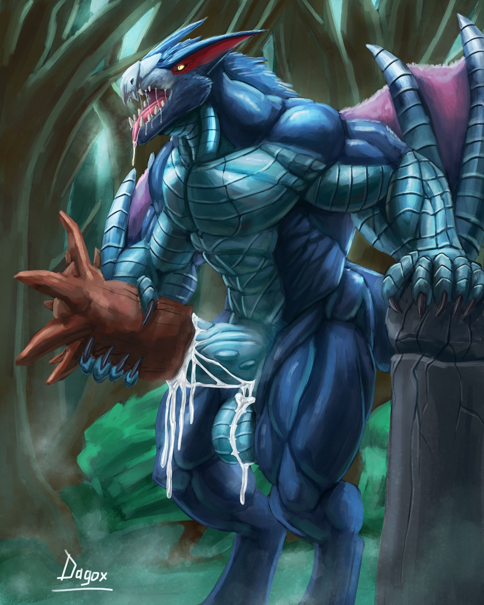
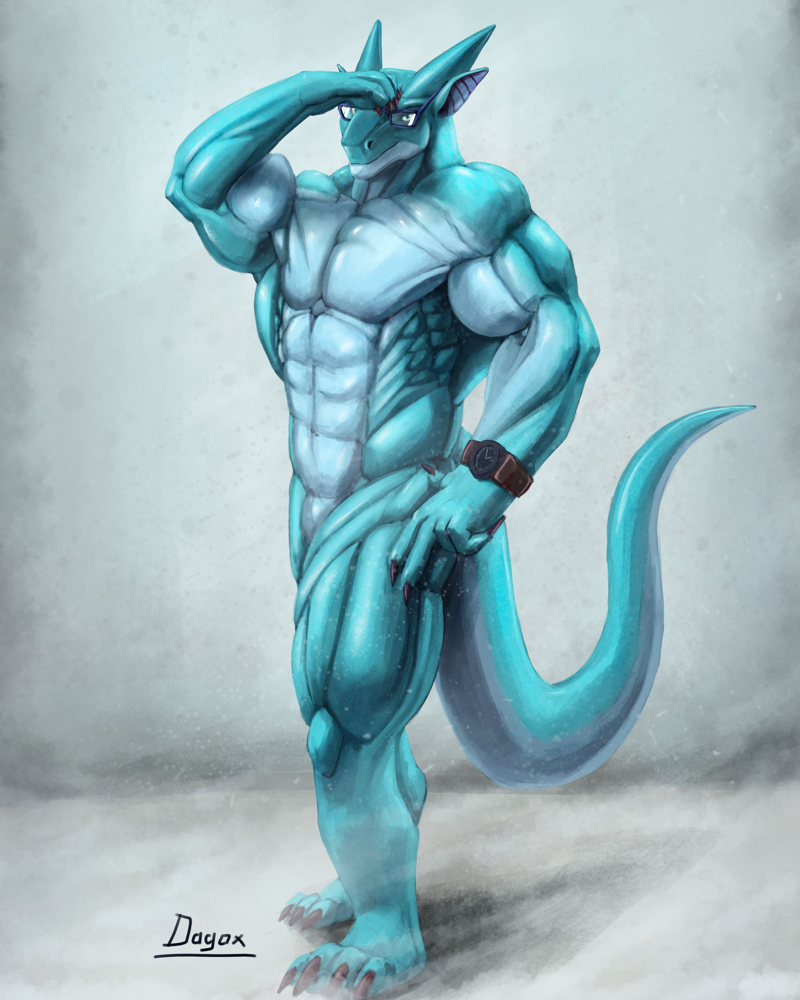
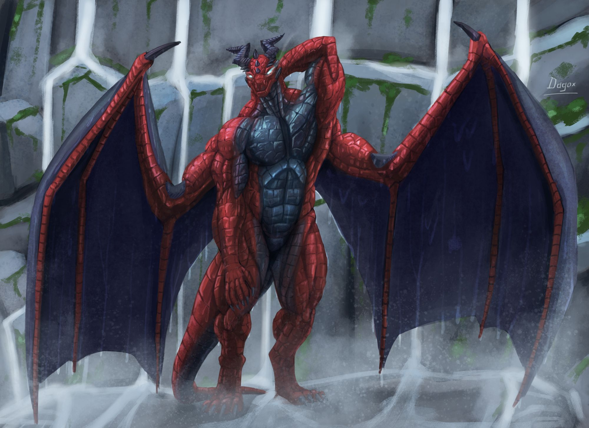

+++
title = "Tier I: Painting"
summary = "Pricing + Available options"
date = "0001-01-04" # Pagination ordering weight XD

draft = false

series = ["Commissions"]
series_order = 4

tags = ['commissions']
+++

[<- Commissions Info](  )

## Examples


    
    
    
    




Click on an image to open it on full page.



Painted illustration of a full height character(s) in any pose.

Depending on compositions, some characters' body part(s) might partially go outside canvas boundaries and / or be covered by other objects / characters.

## Base Options
<ul>
     Base price: $40 
    <li><b>Resolution:</b> From 4000px to 5000px on the largest dimension</li>
    <li><b>Characters:</b> 1 </li>
    <li><b>Background:</b> simple background with some gradient.
        <ul>
            <li>Gradient intensity might vary from almost solid color to high color gradation</li>
        </ul>
    </li>
    <li><b> Clothing:</b> something like simple loincloth / speedos</li>
    <li><b> Tatoos and skin marks:</b> simple tatoos and skin marks with no complex patterns</li>
    <li><b> NSFW:</b> Dicks, cumming, masturbating, etc</li>
</ul>

## Additional options
<ul>
    <li><b>Additional Characters:</b> up to 2
        <ul>
             $20 per character 
            <li>Max amount of character on a single image is 3</li>
        </ul>
    </li>
    <li><b>Complex background:</b>
        <ul>
             $15 
            <li>Complex background may include: landscape, landscape features, buildings, abstract silhouettes of some character(s)</li>
            <li> The background still won't have any really small details</li>
        </ul>
    </li>
    <li><b>Clothing/Armor:</b> 
        <ul>
             $20 
            <li>May include any clothing/armor pieces</li>
            <li>If the character is fully covered by clothing/armor they still increase complexity.</li>
            <li> If character's proportions are too extreme, drawing them in a full metal armor set won't be possible. As an alternative, it could be clothing with smaller armor elements. Due too <b>"too extreme"</b> being a vague term, you can ask me directly if you're unsure</li>
        </ul>
    </li>
    <li><b>Tatoos and skin marks:</b>
        <ul>
             $10 
            <li>Additional references are welcomed, especially those that shows how it looks under different angles</li>
        </ul>
    </li>
</ul>

